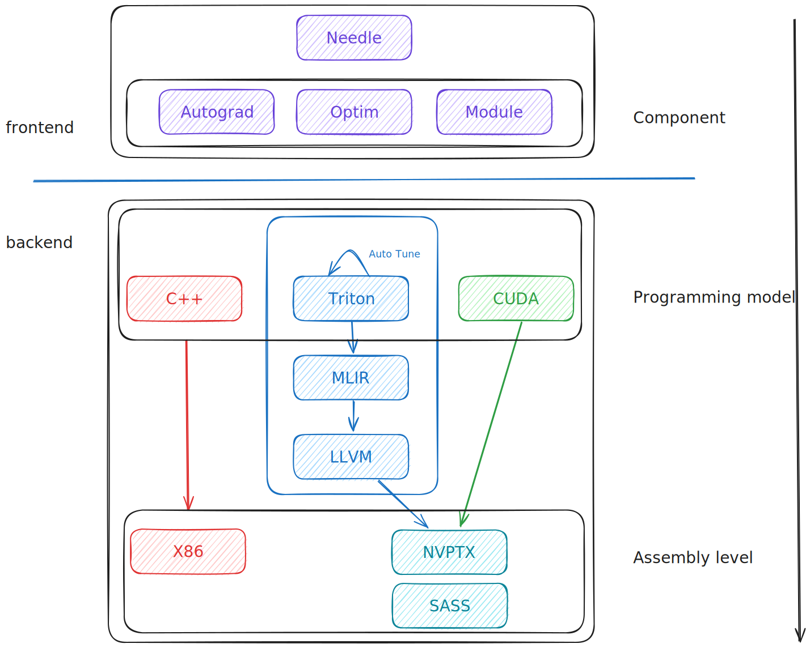

# Tenet
A DL Framework for Tensor Computation, inspired by Needle Framework in [CMU 10-414/714: Deep Learning Systems](https://dlsyscourse.org/).

## Architecture Overview


## Install

### git clone
```bash
git clone https://github.com/Paran0idy/Tenet.git
```
### build
```bash
cd ./Tenet
make
```

### dependence
+ OpenAI Triton
+ Pytorch
```bash
pip3 install torch torchvision torchaudio --index-url https://download.pytorch.org/whl/cu118
pip3 install triton
```


### env
```bash
# using ndarray backend cuda, cpu or triton
export PYTHONPATH=./python && export NEEDLE_BACKEND=nd
```


## Frontend
### Autograd
### Module
### Optim

## Backend
### OpenAI Triton
+ matmul
    + MMA instruction using Tensor Cores, like Ampere Arch
        + `mma.sync.align.m16n8k16`
        + `ldmatrix.sync`
        + `ldmatrix.trans.sync`
+ reduce
+ element-wise

### NVIDIA CUDA
+ matmul
+ reduce
+ element-wise

### X86 CPU
+ matmul
+ reduce
+ element-wise