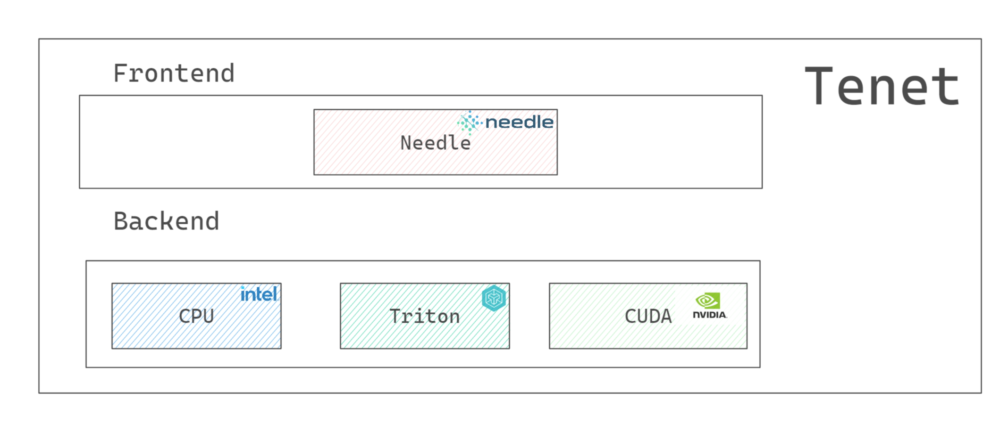

# Tenet
A DL Framework for Tensor Computation


Inspired by Needle Framework in [CMU 10-414/714: Deep Learning Systems](https://dlsyscourse.org/).

## Example
```python
import sys

sys.path.append("../python")
import needle as ndl
import needle.nn as nn
import os
import numpy as np
from needle.backend_ndarray import *

print("----Triton Backend----")

a = ndl.Tensor(np.ones((1024, 1024)), device=triton())
b = ndl.Tensor(np.ones((1024, 1024)), device=triton())
# forward
c = a - b
# backward
c.backward()

print("c : \n", c)
print("a.grad : \n", a.grad)
print("b.grad : \n", b.grad)


print("----CPU Backend----")

x = ndl.Tensor(np.ones((1024, 1024)), device=cpu())
y = ndl.Tensor(np.ones((1024, 1024)), device=cpu())
z = x @ y
z.backward()

print("z : \n", z)
print("x.grad : \n", x.grad)

```

## Install

### git clone
```bash
git clone https://github.com/Paran0idy/Tenet.git
```
### build
```bash
cd ./Tenet
make
```

### dependence
+ OpenAI Triton
+ Pytorch
```bash
pip3 install torch torchvision torchaudio --index-url https://download.pytorch.org/whl/cu118
pip3 install triton
```


### env
```bash
# using ndarray backend cuda, cpu or triton
export PYTHONPATH=./python && export NEEDLE_BACKEND=nd
```


## Frontend
### Autograd
### Module
### Optim

## Backend
### OpenAI Triton
+ matmul

```python
@triton.jit
def matmul_kernel(
    a_ptr, b_ptr, out_ptr,
    M, N, K,
    stride_am, stride_ak,
    stride_bk, stride_bn,
    stride_cm, stride_cn,
    BLOCK_M: tl.constexpr, BLOCK_N: tl.constexpr, BLOCK_K: tl.constexpr,
):
    pid = tl.program_id(0)
    num_pid = N // BLOCK_N
    pid_n = pid % num_pid;
    pid_m = pid // num_pid
    
    m_offset = pid_m * BLOCK_M + tl.arange(0, BLOCK_M)
    n_offset = pid_n * BLOCK_N + tl.arange(0, BLOCK_N)
    
    k_offset = tl.arange(0, BLOCK_K)
    
    # block tiling
    a_start = a_ptr + (m_offset[:, None] * stride_am + k_offset[None, :] * stride_ak)
    b_start = b_ptr + (k_offset[:, None] * stride_bk + n_offset[None, :] * stride_bn)
    
    acc = tl.zeros((BLOCK_M, BLOCK_N), dtype=tl.float32)
    for _ in range(0, K, BLOCK_K):
        # load
        a = tl.load(a_start)
        b = tl.load(b_start)
        # dot using mma instruction
        acc += tl.dot(a, b)
        # advanced
        a_start += BLOCK_K * stride_ak
        b_start += BLOCK_K * stride_bk
    
    c = acc.to(tl.float16)
    # store
    c_start = out_ptr + (m_offset[:, None] * stride_cm + n_offset[None, :] * stride_cn)
    tl.store(c_start, c)
```

MMA instruction using Tensor Cores, like Ampere Arch
>   `mma.sync.align.m16n8k16` \
    `ldmatrix.sync` \
    `ldmatrix.trans.sync`


### NVIDIA CUDA
+ matmul
+ reduce
+ element-wise

### X86 CPU
+ matmul
+ reduce
+ element-wise